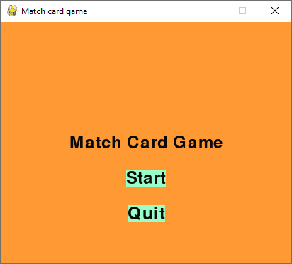
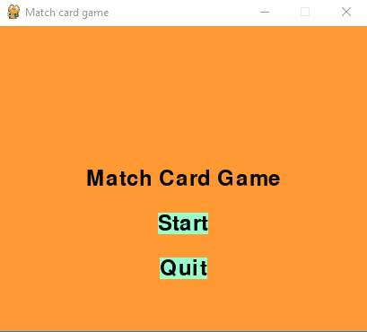
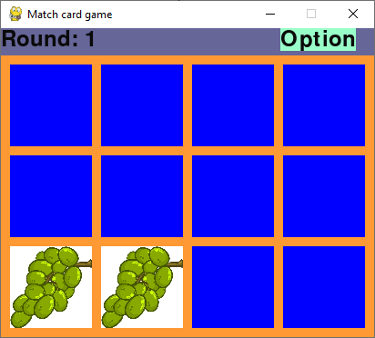
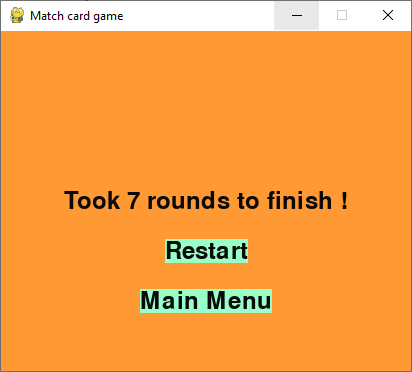

<!-- omit in toc -->
# **Match Card Game**
Match card game is a simple card matching game built with pygame. 
<!-- omit in toc -->
## **Table of Content**
- [**Motivation**](#motivation)
- [**Features**](#features)
- [**How to run**](#how-to-run)
    - [Running the game with python](#running-the-game-with-python)
    - [Running the game without python](#running-the-game-without-python)
- [**Screenshots**](#screenshots)
## **Motivation**
Example of a match card game in MapleStory

When I was young, I spent quite a lot of time on gaming and one particular game is MapleStory. Within the game itself, you can create a public match card game where anyone can join it. I always enjoy playing it. 

Im trying to build more side project to improve my programming skills instead of just passive learning. Since the mechanism of this game is relatively easy, I decided to build it with pygame.

This is my second side project! Do checkout my first side project [classic-snake-game](https://github.com/kahkeong/classic-snake-game)

## **Features**
- Randomized fruit images for each match (taken randomly from 20 images in the fruits folder)
- Customized board grid size (row*column) through command prompt 
- Restart the game whenever you like
- End game statistic to show how many rounds you took to complete the match

## **How to run**
#### Running the game with python
- Change directory to the downloaded project
- Ensure python is set in your windows path
- Type 'python main.py' at your command prompt to run it
- Type "python main.py 5 6" to change the grid size to 5x6 (default is 3x4)
#### Running the game without python
- An executable file is included and it was generated with [pyinstaller](https://www.pyinstaller.org/)
- You still can customize the board grid size as you wish eg. Type "main.exe 5 6" instead
- Note that this is only tested with a Windows machine.
## **Screenshots**
Main menu screen

Card initializing

A pair of card matched will always stay open

End game screen

